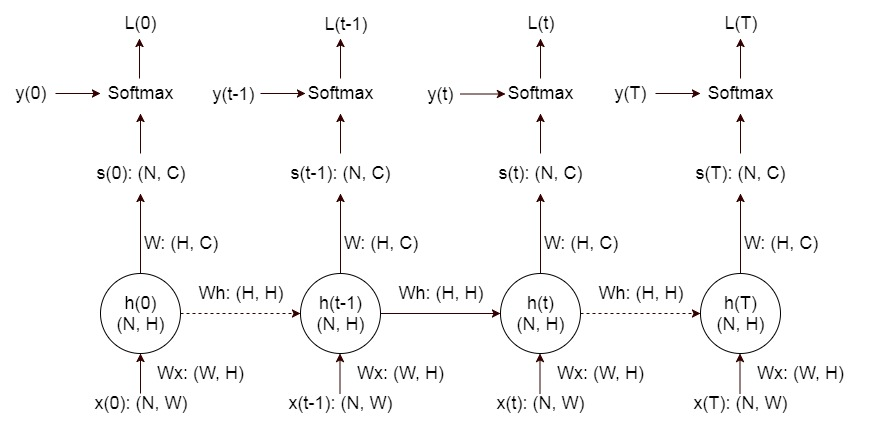

[Assignment3 | RNN Captioning]()
---
这部分实际上做了两件事情，首先建立一个 RNN，然后以此 RNN 为基础，训练一个模型来完成图片 caption 的工作。我感觉作业中的代码先后顺序有些混乱，这里依照自己的理解，把内容重新组织一下。


### Dataset
train 和 val 使用的是 Coco2014，从打印出来的 data 信息来大概浏览一下数据的构成。
```python
train_captions <class 'numpy.ndarray'> (400135, 17) int32
train_image_idxs <class 'numpy.ndarray'> (400135,) int32
train_features <class 'numpy.ndarray'> (82783, 512) float32
idx_to_word <class 'list'> 1004
word_to_idx <class 'dict'> 1004
train_urls <class 'numpy.ndarray'> (82783,) <U63
```
train dataset 中有 82783 张图片，每一张图片对应多个 caption，共有 400135 个caption，每一个 caption 最多包含 17 个整形数字，每一个数字通过 idx_to_word 对应到一个单词。idx_to_word 是一个 list，每一个位置上对应一个单词，其中位置0-3分别是特殊字符 \<NULL>, \<START>，\<END>，\<UNK>。所有的 caption 都是以 \<START> 起，以 \<END> 止，如果不足17个单词，那么在 \<END> 以后补 \<NULL>，不在 idx_to_word 中的记为 \<UNK>。
```python
print(data['train_captions'][1])
print(decode_captions(data['train_captions'][1], data['idx_to_word']))
[  1   4   3 172   6   4  62  10 317   6 114 612   2   0   0   0   0]
<START> a <UNK> view of a kitchen and all of its appliances <END>
```
train feature 是直接取自 VGG16 的第 fc7 层，也就是从 4096 映射到 1000 个 class 的前一层，所以是 4096 维的。这里为了减少计算量，使用 PCA 将维度减小到 512 维。

### Vanilla RNN

RNN 一次处理一个长度为 T 的时间序列 x(0), x(t), ... , x(T)，其中，隐状态 h(t) 由该时刻输入 x(t) 和上一时刻隐状态 h(t-1) 共同决定：
$$
h(t) = \mathrm{tg} \left ( W_x \cdot x(t) + W_h \cdot h(t-1) + b_h \right )
$$
输出的 score 由该时刻的隐状态 h(t) 决定：
$$
s(t) = W \cdot h(t) + b
$$
得到的 score 与该时刻的 y(t) 经过 softmax 后得到该时刻的 Loss。
这里需要学习的参数是 $W_x$，$W_h$，$b_h$，$W$ 和 $b$。需要注意的是，在 RNN 处理该长度为 T 的时间序列 x(t) 时，上述参数是 **不变的**。只有处理完该序列后，才会进行参数的更新，并且在进行参数更新时， RNN 的 loss 是在所有时刻 loss 之和，即：
$$
Loss = L(0) + ... + L(t) + ... + L(T)
$$

作业中将 RNN 中的隐状态转移和 loss 计算分成了两部分，首先按时序先将每一时刻的隐状态表示出来，然后在所有隐状态已知的情况下，将各个时刻的 loss 一步求出。这样做在计算 backprop 时要特别注意某一时刻隐状态的梯度是由（此时刻 loss 的梯度 + 下一隐状态的梯度）两部分组成。而所有要更新的参数 $W_x$，$W_h$，$b_h$，$W$ 和 $b$，其所对应的梯度值，要将各个时刻计算得到的值全部叠加起来。

#### RNN: hidden state transition
##### forward
forward 的计算是根据公式：
$$
h(t) = \mathrm{tg} \left ( W_x \cdot x(t) + W_h \cdot h(t-1) + b_h \right )
$$
原作业中用的名称是 next_h，我认为不妥，应该是根据 prev_h 来计算出 current_h。

##### backward
用维度分析法来推导，这里就不赘述了，要注意的是 $W_h$ 是形如 (H, H) 的，不要忘记也要做转置。

#### RNN: affine layer
这一步是将隐状态映射为 score，根据公式：
$$
s(t) = W \cdot h(t) + b
$$
需要注意的是，这里是在已知所有隐状态的前提下，计算在各个时刻的 score，所以，对于某一时刻而言，h(t) 是形如 (N, H)，而一个 time capsule 中所有隐状态 h 是形如(N, T, H)的。这里代码没有什么可说的，将输入 flatten 一下就好。

#### RNN: softmax layer
与先前 softmax 的计算没什么大的差别，要注意的是由于输出的 caption 的长度不相同的，所以标记为 \<NULL> 的单词不计算入总的 loss。因此要引入一个 mask。

#### RNN: single time capsule
##### forward
forward 没什么好说的，在所有时刻一步步调用 rnn_step_forward 即可。

##### backward
backward 要强调的是它的输入参数，原作业中用的是 dh，这里为了更清楚，记为 dLossdh，它是形如 (N, T, H) 的，表示从某一时刻的 loss 传递到该时刻隐状态的梯度值；而此时刻隐状态的梯度值还包括另外一部分，即从后一时刻隐状态传递到该时刻隐状态的梯度值，即：
```python
dcurrent_h = dLossdh[:, i, :] + dprev_h
```
backprop 从最后一个时刻 h(T) 开始，往 h(0) 计算，而最后一个隐状态没有下一时刻，所以 dprev_h 的初始值应该为 0 ：
```python
dprev_h = np.zeros_like(prev_h)
```
另外需要注意的是，在 RNN 的一个 time capsule 中，所有参数都是 **不进行更新的**，而每一个时刻对参数都计算一个梯度，最后要将每一时刻的这些梯度都加起来：
```python
dx[:, i, :], dprev_h, dWx_, dWh_, dbh_ = rnn_step_backward(dcurrent_h, cache)
dWx += dWx_
dWh += dWh_
dbh += dbh_
```

#### RNN: full rnn step
顺带又加了一种实现方式，即在每一时刻，不但计算出下一时刻的隐状态，同时计算出该时刻的 loss。


end
